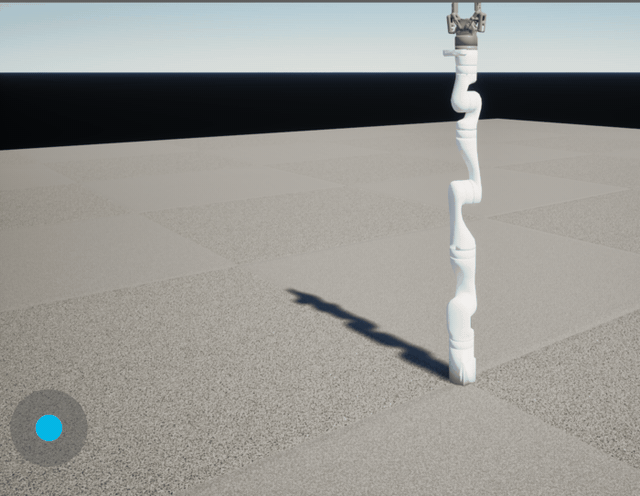

# Newton PIE test

`make_newton_map.py` authors `/Game/Maps/URL/Map_NewtonTest_URL` from scratch:
the smallest scene that exercises Newton behind URLab — a URLab manager, a
one-hinge pendulum built as a component tree, and the Newton solver component
that installs a custom step handler on the manager's physics engine.

No imported assets and nothing from `/RammsPrivateAssets/`, so it lives in the
public repo and compiles in well under a second. A pendulum is also what the
plugin's own parity harness uses, which keeps the two comparable.

```bash
python3 Scripts/editor_remote_exec.py --file Scripts/pie_tests/newton/make_newton_map.py
```

Then press Play, or request it from the MCP toolset's `begin_pie`, and watch
the solver with `newton_status` or in the log under `LogRammsNewton`.

## Two authoring rules this encodes

**The first body under the model root IS the world body.** URLab writes its
children straight onto the spec's existing worldbody rather than nesting a new
one (`MjSpecBuild.cpp`: "The root's body IS the world body"). So a link needs
*two* body levels. Hanging a joint one level up puts it in the world body and
MuJoCo rejects the model with `joint found in world body`.

**Element properties are `TOptional` and start unset.** A freshly added
`MjGeom` has no type and no size, and MuJoCo rejects it with `size 0 must be
positive in geom`. They do set from Python through `set_editor_property`, so
set them explicitly on every element you add.



The arm above is being *commanded*: the end-effector controller traces a circle
while Newton integrates the dynamics. A passive-settling capture is in
`newton_gen3_unreal.gif` alongside it.

The Kinova Gen3 with its 2F-85 gripper, stepped by Newton through URLab's custom
step handler and rendered by Unreal. `run_newton_capture.py` swaps the pendulum
for `Content/Robots/URL/gen3_2f85_fixed` and starts play; the solver reports

    [NewtonSolver] Newton stepping active (mujoco_cpu, nq=15 nu=8)

## A trap worth knowing

**Subobject handles go stale.** A handle from an earlier gather is invalid once
the next add reshapes the tree, and using one silently attaches to the root
instead — which is how an entire body level went missing here, with no error.
`add_component` re-resolves parents by object on every call for that reason.

That bug also produced a false diagnosis worth recording: the level looked as
though it did not survive save and reload, because the body it was missing had
never been created in the first place. `Map_NewtonTest_URL.umap` is committed
and does round-trip — reloading it from disk gives back
`Spec -> World -> Link -> (Hinge, Capsule)` and plays straight into
`Newton stepping active (mujoco_cpu, nq=1 nu=0, pipelined)`. Re-run the script
to change the scene, not to repair it.
